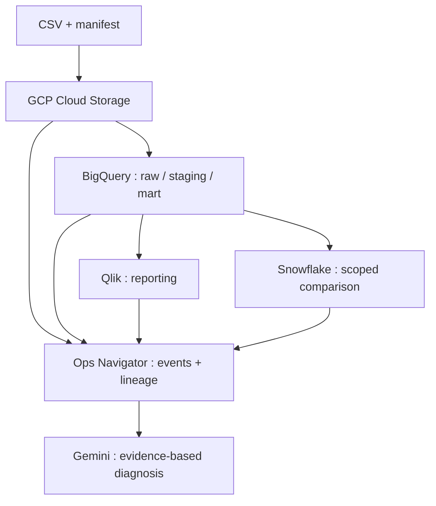
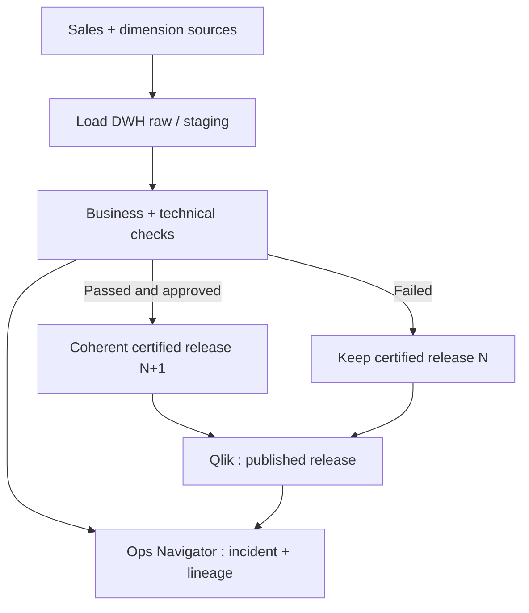
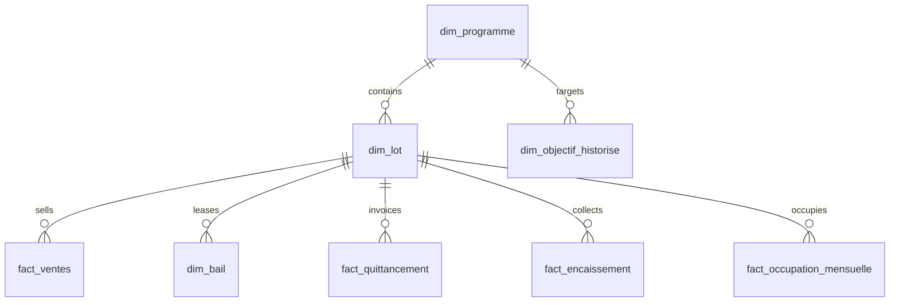
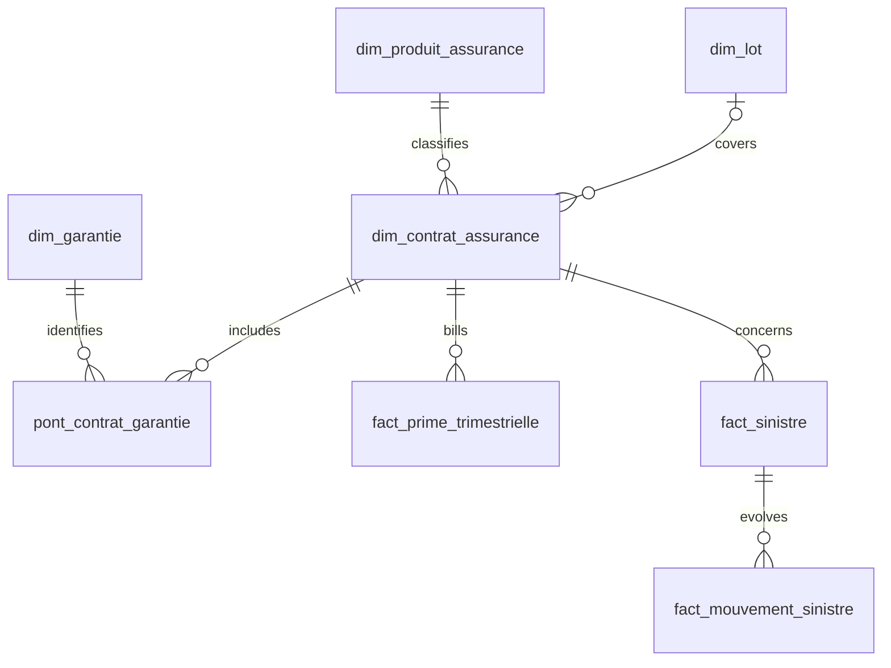

<p align="right">
  <a href="README.md">FR</a> | <strong>EN</strong>
</p>

<h1>Veloriax Habitat Lab </h1>

**Veloriax Habitat is entirely fictional.** This repository provides reusable synthetic real estate and insurance data for an observable BI chain. Its business question is: *which figure can the investment committee trust when a source, warehouse table, or reload fails?*

## What is included

- [Synthetic dataset](datasets/): **2,219,346 rows across 25 tables**, January 2023–December 2026. The archive is split into three parts, with [archive checksums](datasets/archive.json) and a [per-file manifest](datasets/manifest.json).
- [Deterministic Python generators](src/) and [integrity and relationship checks](scripts/validate_dataset.py).
- [Architecture and certified-release decision flow](docs/architecture.md), [data model and all table columns](docs/modele.md), [KPIs and quality rules](docs/indicateurs.md), [Ops Navigator incident scenario](docs/operations.md), and [loading guidance](docs/import.md). Detailed documentation is currently in French.
- [Ops Navigator experience specification](docs/experience-ops-navigator.md), [demo event contract](apps/ops-navigator/README.md), and [Google AI Studio build and refinement prompts](prompts/google-ai-studio/01-ops-navigator.md). These specifications and prompts are currently in French.

The data, company, amounts, incidents, and ratios are fictional. They do not represent market observations or a real insurer.

## Quick start

```bash
python scripts/unpack_dataset.py data
python scripts/validate_dataset.py data
```

To regenerate the same synthetic dataset:

```bash
python src/generate.py --out data
python src/extend_assurance.py --data data
python scripts/validate_dataset.py data
```

The original CSVs are kept inside the segmented archive tracked by Git. The extracted `data/` directory is ignored.

## Target architecture



This is an **architecture to implement**. Google AI Studio will help prototype the Ops Navigator UI; collectors, cloud connections, and Qlik applications have not been deployed. [Detailed architecture and multi-node Qlik target](docs/architecture.md) (French).

## Releasing a trustworthy figure



If N+1 fails, Qlik still displays N **with its date and a freshness warning**. Recovery requires reconciliation, human approval, and post-reload verification.

## Data model





Facts have different grains. Aggregate invoices, receipts, premiums, and claim movements appropriately before joining amounts. [Full 25-table dictionary and join rules](docs/modele.md) (French).

## Lab roadmap

| Tool | Purpose | Status |
| --- | --- | --- |
| Python, CSV, Git | Generate, validate, and share reproducible data | **Delivered** |
| GCP Cloud Storage | Receive immutable batches and verify integrity | Planned |
| BigQuery | Main warehouse, historical objectives, quality, job and cost monitoring | Planned |
| Snowflake | Compare a controlled subset of figures and processing times | Planned |
| Qlik Sense Desktop | Business dashboard and investigation with alternate states | Planned |
| Ops Navigator | Events, lineage, incident timeline, release status | Demo contract and prompts delivered; app planned |
| Google AI Studio | Prototype the supervision UI from versioned prompts | Prompts delivered; app planned |
| Gemini diagnostic assistant | Evidence-based, read-only incident hypotheses | Final stage |

A multi-node Qlik Sense Enterprise deployment on GCP is a **documented target**, not a deployed part of this repository. No actual cloud cost, query-performance, or availability results are claimed.

## Publication rule

The business dashboard displays the **last certified, coherent release**, its validity date, and an explicit freshness warning. A candidate release is promoted only after sales, dimensions, objectives, and KPIs pass their controls and a human validates publication. A technically successful but incomplete reload does not certify a figure. The investigation view may compare candidate and certified releases; the business dashboard reads only the published one.

## Reuse

[LICENSE-PROPOSAL.md](LICENSE-PROPOSAL.md) describes proposed public reuse terms. It does **not** grant a license until the rights holder approves and publishes the final license texts.
