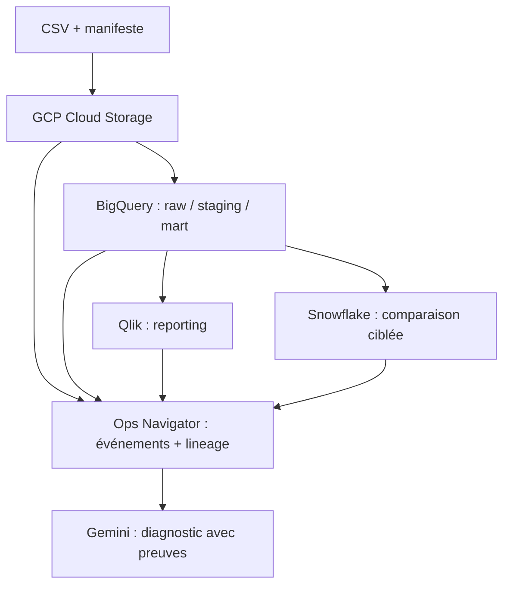
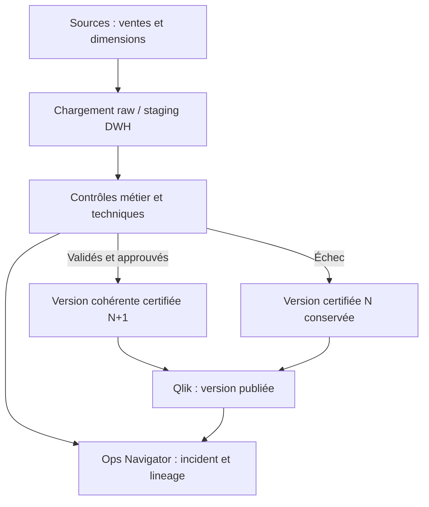
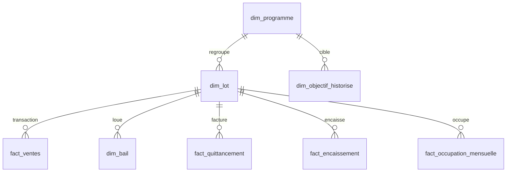
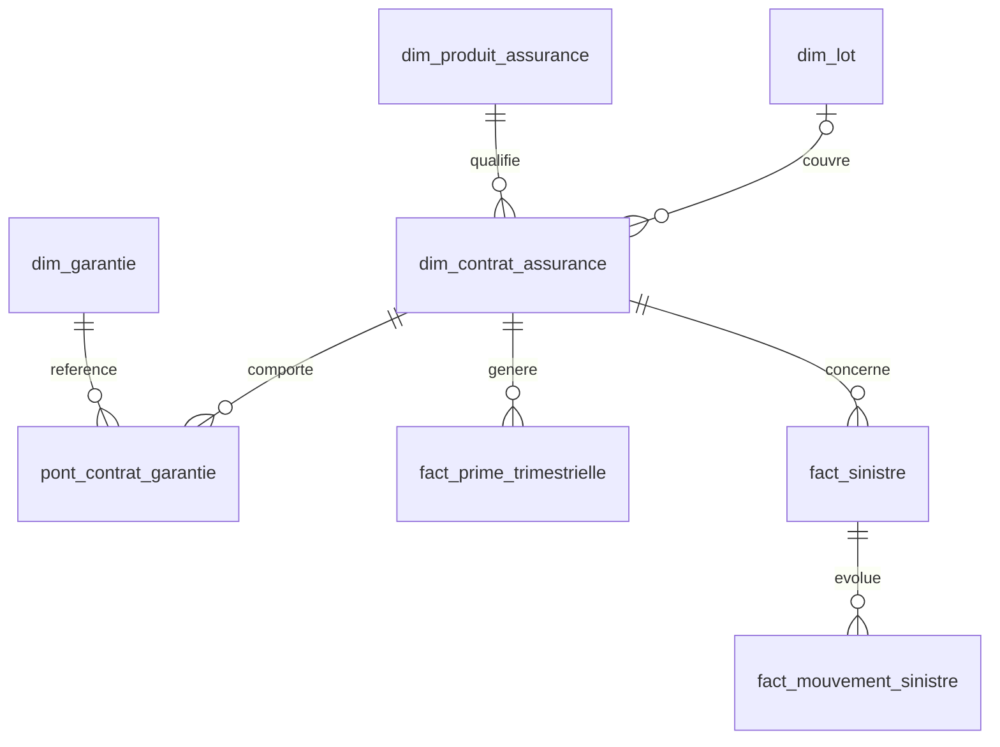

<p align="right">
  <strong>FR</strong> | <a href="README.en.md">EN</a>
</p>

<h1>Veloriax Habitat Lab </h1>

**Veloriax Habitat est une société entièrement fictive.** Ce dépôt fournit un socle de données immobilières et d'assurance pour construire une chaîne BI observable. Il répond à une question métier : *quel chiffre présenter au comité quand une source, une table ou un rechargement devient douteux ?*

## Ce qui est disponible

- [Jeu de données synthétiques](datasets/) : **2 219 346 lignes, 25 tables**, janvier 2023 à décembre 2026 ; archive découpée en trois segments, [empreinte de l'archive](datasets/archive.json) et [comptes par CSV](datasets/manifest.json).
- [Deux générateurs Python](src/) déterministes, sans dépendances externes.
- [Modèle et dictionnaire](docs/modele.md), [KPI et contrôles](docs/indicateurs.md), [architecture](docs/architecture.md), [scénarios Ops Navigator](docs/operations.md) et [chargement](docs/import.md).
- [Expérience Ops Navigator](docs/experience-ops-navigator.md), [contrat d'événements et scénario démo](apps/ops-navigator/README.md), [prompt Google AI Studio](prompts/google-ai-studio/01-ops-navigator.md) et [prompt d'itération](prompts/google-ai-studio/02-incident-room.md).
- [Phase 1 : contrat du KPI « CA comité » et référence locale reproductible](docs/phase1-ca-comite.md), avec [résultat JSON](results/ca_comite_2026-09-27.json).
- [Phase 2 : chargement BigQuery pilote et réconciliation](docs/phase2-bigquery.md) ; scripts et schémas prêts, sans déploiement cloud à ce stade.

Les [schémas d'architecture et de publication](docs/architecture.md#architecture-technique-cible) ainsi que les [deux vues du modèle de données](docs/modele.md#vue-relationnelle--ventes-location-et-objectifs) sont rendus directement par GitHub.

Les données, les noms de lots, les montants et les sinistres sont fictifs. Aucune donnée du support de référence ni d'un assureur réel n'a été reprise. Les ratios générés ne représentent aucun marché.

## Démarrer

1. Télécharger le dépôt et lancer `python scripts/unpack_dataset.py data` pour vérifier et extraire l'archive segmentée.
2. Lancer `python scripts/validate_dataset.py data` pour vérifier volumes, empreintes, clés et périodes.
3. Importer d'abord les dimensions, puis les faits ; consulter les consignes dans [docs/import.md](docs/import.md).

Pour régénérer le même jeu de données :

```bash
python src/generate.py --out data
python src/extend_assurance.py --data data
python scripts/validate_dataset.py data
```

Le volume se règle avec `--rental-lots`, `--sale-lots` et les plafonds des deux scripts. Les trois segments de l'archive restent suivis par Git ; le dossier `data/` est ignoré. Le manifeste versionne le contenu, pas une mesure de performance.

## Architecture cible



Cette chaîne est **une architecture à implémenter**. Google AI Studio servira à prototyper l'IHM d'Ops Navigator ; les collecteurs, connexions cloud et applications Qlik ne sont pas encore déployés. [Détail des rôles et de Qlik multi-nœud](docs/architecture.md).

## Publication d'un chiffre fiable



Quand N+1 échoue, Qlik affiche toujours N **avec sa date et une alerte de fraîcheur**. La reprise demande réconciliation, validation humaine et contrôle après reload.

## Modèle de données





Les faits ont des grains différents : ne pas joindre directement les montants de quittancement, encaissement, primes et sinistres sans agrégation adaptée. [Dictionnaire complet des 25 tables et règles de jointure](docs/modele.md).

## Parcours du lab

| Outil | Objectif | État |
| --- | --- | --- |
| Python, CSV, Git | Générer, contrôler et partager un jeu reproductible | **Livré** |
| GCP Cloud Storage | Réception, version et preuve d'intégrité des lots | À réaliser |
| BigQuery | DWH principal, qualité, historisation, coûts et jobs | À réaliser |
| Snowflake | Rejouer un sous-ensemble et comparer chiffres et temps | À réaliser |
| Qlik Sense Desktop | Dashboard métier et comparaison par états alternatifs | À réaliser |
| Ops Navigator | Journal des événements, lineage, incidents et versions | À réaliser |
| Google AI Studio | Prototyper l'IHM de supervision à partir des prompts versionnés | Prompts et données démo livrés ; app à réaliser |
| Agent IA | Formuler un diagnostic étayé, en lecture seule | Dernière étape |

Une architecture Qlik Sense Enterprise sur GCP à plusieurs nœuds sert de **cible documentaire** ; elle n'est pas déployée par ce dépôt. Aucune mesure réelle de coût, durée ou disponibilité des services cloud n'est annoncée.

## Règle de publication

Le comité consulte la **dernière version certifiée** avec sa date de validité. Une nouvelle version n'est publiée qu'après validation des faits, dimensions, objectifs et KPI. Un chargement techniquement réussi mais incomplet reste bloqué. L'application d'investigation peut comparer candidat et version certifiée ; le reporting métier ne lit que la version publiée.

## Partage

Les conditions proposées pour une publication publique sont décrites dans [LICENSE-PROPOSAL.md](LICENSE-PROPOSAL.md). Elles doivent être approuvées par le titulaire avant publication. Les données synthétiques restent librement inspectables dans ce dépôt de travail local.
