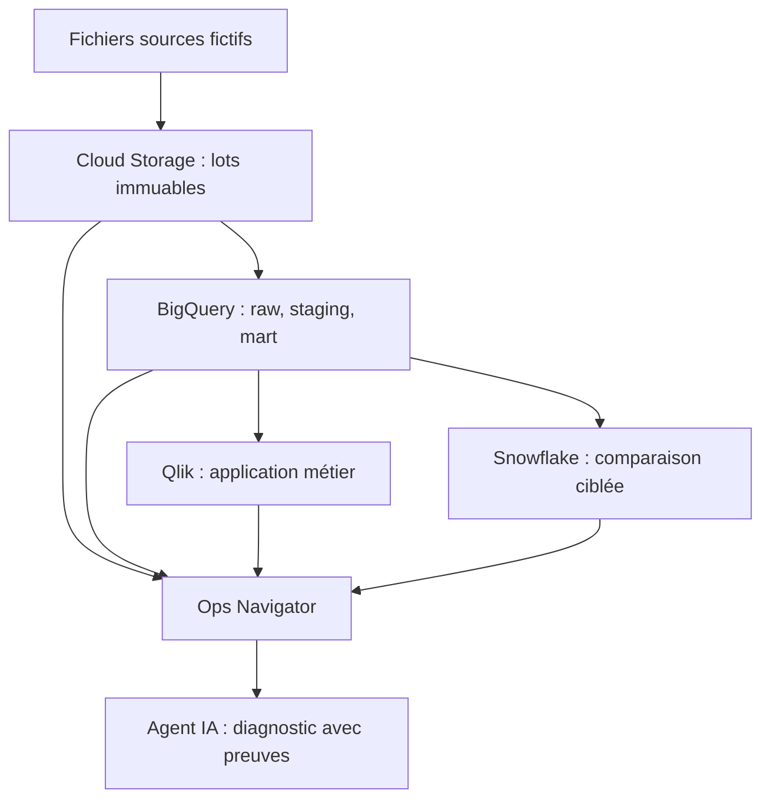

# Architecture et rôle des outils

## Chaîne visée

Google AI Studio sert d'atelier de création de l'IHM **Ops Navigator** à partir des prompts versionnés dans ce dépôt. Le code généré doit être revu, testé et suivi par Git. L'application lit un contrat d'événements ; elle ne remplace ni Cloud Logging, ni les métadonnées BigQuery/Snowflake, ni les journaux Qlik. Une démo sur événements fictifs précède les adaptateurs authentifiés.

Le dépôt livre les fichiers et générateurs. Les flèches ci-dessus décrivent le **travail à implémenter**, pas des connexions déjà opérationnelles.

| Couche | Entrée | Sortie | Trace exigée |
| --- | --- | --- | --- |
| Réception GCP | CSV + manifeste | lot accepté ou rejeté | empreinte, nom, acteur, heure |
| Raw BigQuery | lot accepté | tables au grain source | job ID, nombre de lignes, octets |
| Staging | raw | types, références, contrôles | version de règle et anomalies |
| Mart certifié | staging complet | `release_id` publié | résultats des contrôles, valideur |
| Snowflake | copie délimitée | résultats comparables | requête, durée, crédits, écart |
| Qlik métier | mart certifié | KPI et graphiques | version chargée, date du reload |
| Qlik investigation | certifié + candidat | écarts côte à côte | statut et provenance des deux versions |
| Ops Navigator | événements et dépendances | chronologie et impact | `run_id`, `release_id`, `incident_id` |
| Google AI Studio | prompt, contrat et fixtures | prototype d'application web | version du prompt, commit et revue du code |

## Versions et reprise

`raw` est conservé ; `staging` accueille le candidat ; `mart` ne pointe sur une version qu'après les contrôles. Pour un incident sur `ventes` ou `dim_programme`, garder un **ensemble cohérent** : ventes et dimensions de la même version certifiée. Montrer explicitement la fraîcheur et suspendre toute promotion automatique. Une restauration BigQuery ou un rejeu n'autorise la publication qu'après réconciliation et validation humaine.

Les états alternatifs Qlik isolent les **sélections**. Ils ne sauvegardent ni tables ni applications. Le candidat et le certifié doivent être présents dans le modèle de l'application d'investigation avec un identifiant de version ; l'application métier reste sur le certifié.

## Qlik Enterprise : cible documentaire

Sur GCP Compute Engine : nœud central avec QMC et repository, nœud de rechargement, nœud de consultation, stockage/référentiel résilients et réseau privé. Les responsabilités des nœuds et le basculement demandent un déploiement Enterprise distinct. Pour ce lab personnel, Qlik Sense Desktop sur le poste Windows est le périmètre exécutable prévu.

## Sécurité et coûts à vérifier pendant l'implémentation

Séparer les comptes de service par étape, limiter l'accès aux sinistres et données de locataires, journaliser les consultations et restreindre l'agent IA à la lecture. Mesurer BigQuery `JOBS`/audit logs et Snowflake `QUERY_HISTORY`/historique de consommation en indiquant leur fraîcheur. Les budgets GCP signalent un dépassement potentiel mais ne remplacent pas les quotas et contrôles de requêtes.
