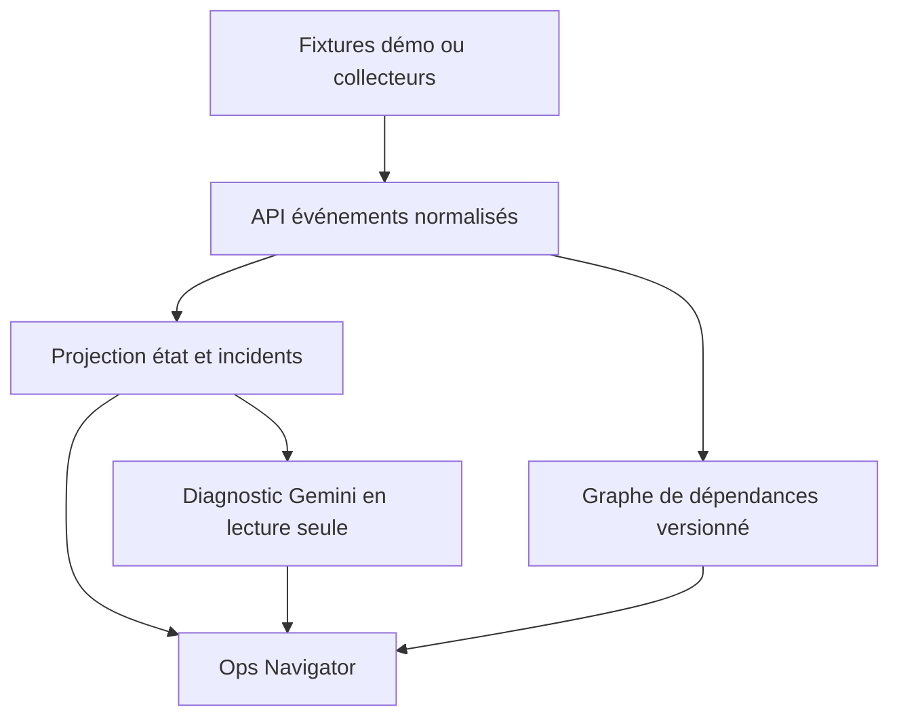

# Ops Navigator : expérience de supervision

**Promesse de la démo :** à 08:00, la vente manque dans le DWH. Le comité voit encore le dernier chiffre certifié avec son ancienneté ; l'exploitation remonte la chaîne jusqu'à la table absente ; le responsable prend une décision explicite de publication. Toute l'expérience tient dans une seule application, pas dans des tableaux de bord dispersés.

## Trois vues, trois décisions

| Vue | Question | Traitement visuel et interaction |
| --- | --- | --- |
| **Pulse** | Peut-on utiliser le CA comité ? | Hero KPI, version certifiée, horodatage, seuil de fraîcheur, badge « visible mais périmé ». Frise des dernières étapes ; filtre par patrimoine, flux et criticité. |
| **Impact Map** | Qu'est-ce qui est touché ? | Graphe sources → tables → champs → calculs → applications → KPI ; clic sur `dwh.ventes` pour révéler le sous-graphe et les utilisateurs concernés. Direction du flux et versions visibles. |
| **Incident Room** | Qui fait quoi et sur quelles preuves ? | Chronologie `DD/MM/YYYY hh:mm:ss`, avant/après, preuves consultables, hypothèses et inconnues, actions assignées, décision de reprise et temps écoulé. |

La séquence premium est **une démonstration de continuité dégradée** : « CA publié hier » reste affiché, avec un ruban de fraîcheur rouge. La vue Ops montre simultanément le candidat bloqué et la version certifiée. Le feu vert revient uniquement après contrôles et validation humaine. Aucune animation ne doit masquer l'heure réelle du dernier événement observé.

## Contrat UX

- Un statut porte toujours `état`, `heure d'observation`, `source` et `version` ; ne jamais peindre en vert une source qui ne répond plus.
- Une jauge de fraîcheur distingue « valeur valide à sa date » de « valeur à jour ». Le métier voit le seuil en clair.
- La timeline peut rejouer l'incident fictif à vitesse accélérée, mais porte en permanence la mention **DÉMO — événements simulés**.
- Le mode accessible comprend contraste suffisant, statut écrit en plus de la couleur, navigation clavier, focus visible et réduction des animations.
- Pour la démonstration : fond clair, typographie lisible, grands espaces, rouge/orange/vert réservés aux états, graphe sobre et transitions courtes. Les captures d'écran doivent être compréhensibles sans voix off.

## Architecture logique

Google AI Studio aide à générer **l'application** et à itérer sur son design. Le moteur de supervision est déterministe : ingestion, dédoublonnage par `event_id`, tri par horodatage, calcul des seuils et règle de publication. Gemini ne calcule pas le statut ; il peut proposer des hypothèses justifiées en citant des `event_id` et des preuves. Un diagnostic sans preuve est marqué « non étayé ».

## Adaptateurs après la démo

| Source | Signal et preuve | Limite pratique |
| --- | --- | --- |
| Cloud Storage | arrivée du lot, empreinte, compte et heure | ne prouve pas que le chargement a réussi |
| BigQuery | jobs, volumes, tables, audit et erreurs | fraîcheur de chaque vue/log à afficher |
| Snowflake | chargements, requêtes et écarts sur périmètre commun | comparer aussi unité, filtre, période et coût |
| Qlik Desktop puis Enterprise | reload, modèle chargé, version du KPI | Desktop n'offre pas une QMC multi-nœud ; collecteur distinct pour la cible Enterprise |

L'API de collecte sera côté serveur, avec comptes de service limités à la lecture, contrôle d'accès par rôle, filtrage des données personnelles, rétention des preuves et journal des accès. Les clés API restent côté serveur. Un rafraîchissement fréquent de l'IHM n'est pas une garantie de temps réel : afficher `observed_at` et `ingested_at` séparément.

## Mesures de valeur à relever

Temps **détection → identification de la cause**, **identification → décision de publication**, pourcentage d'incidents avec preuve, nombre de fausses alertes, âge maximum du KPI publié et coût des collecteurs. Ces mesures restent à produire ; aucun gain n'est revendiqué ici.

## Sources techniques

- [Google AI Studio, mode Build](https://ai.google.dev/gemini-api/docs/aistudio-build-mode) : app web full stack, import et synchronisation GitHub, secrets côté serveur.
- [BigQuery INFORMATION_SCHEMA.JOBS](https://docs.cloud.google.com/bigquery/docs/information-schema-jobs) : métadonnées de jobs proches du temps réel.
- [Gemini structured output](https://ai.google.dev/gemini-api/docs/structured-output) : réponse structurée ; la justesse des preuves reste à vérifier dans notre code.
