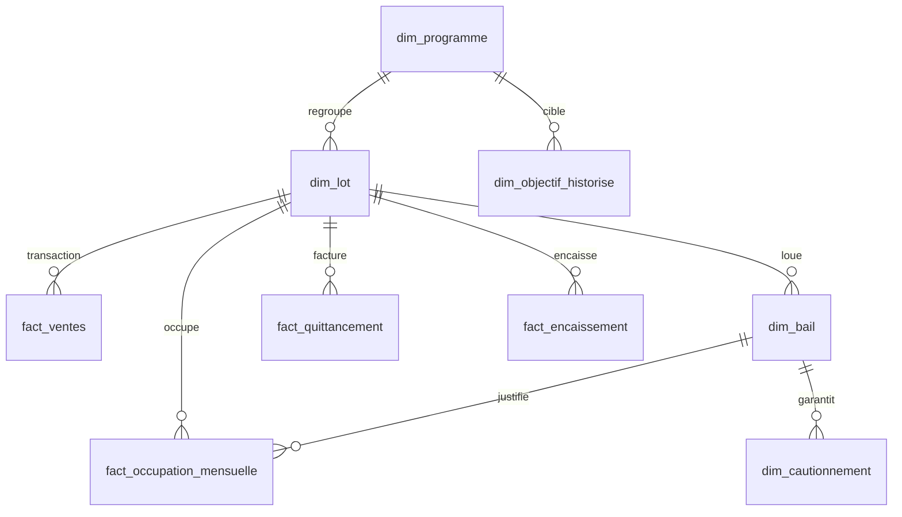
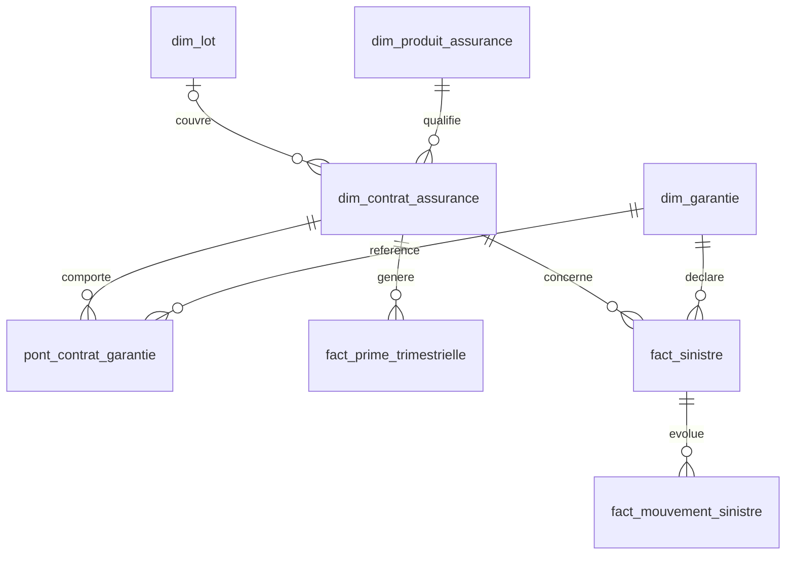

# Modèle de données et dictionnaire

25 fichiers CSV, avec en-tête UTF-8 et séparateur virgule. Chaque ligne du tableau correspond à un fichier livré ; les colonnes sont données dans leur ordre réel. Les cardinalités sont celles de la version archivée, et non des volumes de production.

## Vue relationnelle : ventes, location et objectifs

`fact_ventes` a pour grain l'événement commercial signé ; `fact_quittancement` est à la ligne de type par lot-mois ; `fact_encaissement` et `fact_occupation_mensuelle` sont au lot-mois. L'objectif est historisé par programme, KPI et trimestre : la révision valable à la date de connaissance doit être sélectionnée avant tout calcul.

## Vue relationnelle : contrats, garanties et sinistres

Le programme possède des lots. Un lot peut avoir plusieurs baux, transactions, diagnostics et contrats au fil du temps. Un contrat porte plusieurs garanties ; `pont_contrat_garantie` est une table de liaison temporelle. Certains contrats couvrent directement un programme ou un professionnel et n'ont pas de `lot_id` : conserver ces liens optionnels dans le modèle physique. Les événements d’incident sont séparés des faits métier.

| Table | Grain | Lignes | Colonnes |
| --- | --- | ---: | --- |
| `dim_entreprise` | Entreprise fictive unique | 1 | `entreprise_id`, `nom`, `type_entreprise`, `fictive` |
| `dim_programme` | Programme immobilier | 160 | `programme_id`, `region_code`, `segment`, `statut`, `annee_livraison` |
| `dim_lot` | Lot physique | 56,000 | `lot_id`, `programme_id`, `mode_commercialisation`, `surface_m2`, `pieces`, `type_lot` |
| `dim_professionnel` | Professionnel partenaire | 32 | `professionnel_id`, `region_code`, `activite_principale` |
| `dim_mandat` | Mandat de gestion | 160 | `mandat_id`, `professionnel_id`, `programme_id`, `activite`, `date_debut`, `date_fin`, `statut` |
| `dim_bail` | Bail et période contractuelle | 41,340 | `bail_id`, `lot_id`, `date_debut`, `date_fin`, `surface_m2`, `protection_impayes`, `nature_bail` |
| `dim_cautionnement` | Cautionnement de bail | 1,500 | `cautionnement_id`, `bail_id`, `lot_id`, `dispositif`, `date_effet`, `date_fin`, `organisme`, `profil_eligibilite_simule`, `statut` |
| `dim_produit_assurance` | Produit de protection | 12 | `produit_code`, `libelle`, `famille` |
| `dim_garantie` | Code de garantie | 22 | `garantie_code`, `famille_sinistre` |
| `dim_contrat_assurance` | Contrat annuel | 65,628 | `contrat_id`, `produit_code`, `lot_id`, `programme_id`, `professionnel_id`, `assureur_id`, `date_effet`, `date_echeance`, `prime_annuelle_centimes`, `systeme_source`, `statut`, `release_id` |
| `dim_garantie_financiere` | Garantie annuelle d’un professionnel | 128 | `garantie_financiere_id`, `professionnel_id`, `garant_id`, `date_effet`, `date_fin`, `plafond_centimes`, `regime`, `nature` |
| `dim_objectif_historise` | Programme × KPI × trimestre × révision | 10,240 | `objectif_version_id`, `programme_id`, `kpi_code`, `periode_debut`, `periode_fin`, `valeur_cible`, `revision`, `valide_du`, `valide_au_exclu`, `motif_revision`, `auteur_role` |
| `pont_contrat_garantie` | Contrat × garantie × période de couverture | 259,668 | `contrat_id`, `garantie_code`, `couvert_du`, `couvert_au`, `plafond_centimes`, `franchise_centimes` |
| `fact_ventes` | Événement commercial signé | 60,000 | `evenement_id`, `lot_id`, `date_evenement`, `type_evenement`, `montant_centimes`, `source_lot`, `release_id` |
| `fact_quittancement` | Lot × mois × type de ligne | 864,000 | `quittance_id`, `lot_id`, `mois`, `type_ligne`, `montant_centimes`, `franchise_centimes`, `occupe`, `source_lot`, `release_id` |
| `fact_encaissement` | Encaissement de lot et mois | 288,000 | `encaissement_id`, `lot_id`, `mois`, `montant_centimes`, `statut`, `release_id` |
| `fact_occupation_mensuelle` | Lot × mois | 288,000 | `occupation_id`, `lot_id`, `mois`, `bail_id`, `statut_occupation`, `surface_m2` |
| `fact_dpe` | Diagnostic énergétique d’un lot | 6,000 | `diagnostic_id`, `lot_id`, `date_diagnostic`, `classe_energie`, `conso_kwh_m2_an`, `ges_kgco2_m2_an`, `origine` |
| `fact_travaux` | Intervention sur un lot | 2,000 | `travaux_id`, `lot_id`, `date_commande`, `type_travaux`, `budget_centimes`, `realise_centimes`, `statut` |
| `fact_valorisation` | Valorisation annuelle d’un programme | 160 | `valorisation_id`, `programme_id`, `date_valeur`, `valeur_centimes`, `methode` |
| `fact_prime_trimestrielle` | Contrat × trimestre | 258,912 | `prime_ligne_id`, `contrat_id`, `trimestre_debut`, `prime_emise_centimes`, `prime_acquise_centimes`, `statut`, `release_id` |
| `fact_sinistre` | Dossier de sinistre | 707 | `sinistre_id`, `contrat_id`, `lot_id`, `garantie_code`, `date_survenance`, `date_declaration`, `cout_estime_centimes`, `produit_code` |
| `fact_mouvement_sinistre` | Mouvement de sinistre | 1,306 | `mouvement_id`, `sinistre_id`, `date_mouvement`, `type_mouvement`, `paye_delta_centimes`, `provision_delta_centimes`, `recours_delta_centimes` |
| `fact_mouvement_fonds` | Mouvement financier de mandat | 15,360 | `mouvement_fonds_id`, `mandat_id`, `date_mouvement`, `type_mouvement`, `montant_signe_centimes` |
| `ops_incident_scenario` | Événement simulé de la chronologie Ops | 10 | `scenario_id`, `date_heure_paris`, `objet`, `type_panne`, `action_attendue` |

## Règles de jointure et de temps

- `dim_lot.programme_id` → `dim_programme.programme_id` ; `dim_bail.lot_id`, les faits de lot et les contrats de lot → `dim_lot.lot_id`.
- `fact_occupation_mensuelle.bail_id` → `dim_bail.bail_id` si occupé. Éviter de joindre directement quittances, encaissements et occupation au seul `lot_id` : agréger chaque fait à `lot_id × mois` avant rapprochement.
- `fact_sinistre.contrat_id` → `dim_contrat_assurance.contrat_id` ; `fact_mouvement_sinistre.sinistre_id` → `fact_sinistre.sinistre_id`. Joindre à la garantie sur le contrat, le code et l’intervalle de couverture, sans multiplier les montants des mouvements.
- `fact_prime_trimestrielle.contrat_id` → contrat. Agréger les primes avant liaison à `pont_contrat_garantie`, ou allouer la prime par règle métier documentée.
- `dim_objectif_historise` : clé logique (`programme_id`, `kpi_code`, `periode_debut`, `periode_fin`) et filtre `valide_du <= date_connaissance < valide_au_exclu` ; borne vide = ouverte. La révision n’est pas une nouvelle cible à additionner.
- Dates au format `YYYY-MM-DD` dans les CSV ; la chronologie Ops utilise l’heure locale `Europe/Paris` en `YYYY-MM-DD hh:mm:ss`. Convertir explicitement en horodatage avec fuseau au chargement.
- `montant_centimes`, `prime_*_centimes`, `plafond_centimes`, `franchise_centimes` sont des entiers en centimes. `valeur_cible` suit l’unité de `kpi_code` : ne jamais supposer que toutes les cibles sont monétaires.
- `release_id` identifie la version publiée sur certains faits et contrats, tandis que le manifeste porte les empreintes des fichiers. La version certifiée forme un ensemble cohérent ; une table isolée restaurée ne suffit pas à promouvoir une version.

## Délimitation du cas pratique

Les dimensions et événements couvrent ventes, location, occupation, énergie, travaux, assurance habitation et propriétaire, impayés, vacance, carence, protection juridique, dommage ouvrage, sinistres et fonds confiés. Les produits et garanties sont **simulés** ; l’éligibilité, les exclusions et tarifs ne constituent pas des offres réelles.

Certains faits ont des grains différents : une jointure physique naïve produit des duplications. Le modèle analytique cible doit exposer des marts par usage, des clés stables et des tests de réconciliation entre raw, staging et publication.
