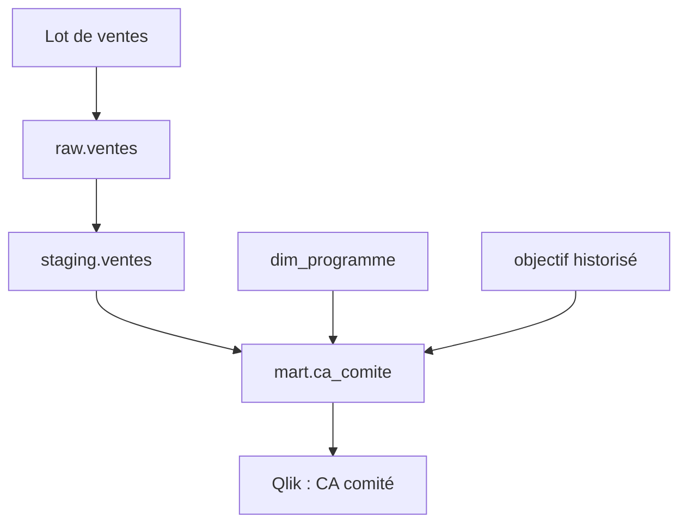

# Ops Navigator : suivi et diagnostic

## Événement commun

Chaque collecteur émet un événement avec : `event_id`, `timestamp_utc`, `timestamp_europe_paris`, `source_system`, `run_id`, `release_id`, `asset_id`, `asset_type`, `status`, `owner_type`, `owner_id`, `input_rows`, `output_rows`, `control_id`, `evidence_uri`, `incident_id`. Les comptes de service et acteurs humains sont distingués. Un nombre de lignes est publié après confirmation par la source, pas déduit d'un message de succès.

## Lineage exploitable



À chaque lien : identifiant d'objet, colonne si connue, version de transformation, job/reload qui l'a créé. Le lineage automatique du cloud ne couvre pas seul les objets Qlik : enregistrer explicitement application, script, champ et KPI. Une modification de `dim_programme` doit afficher tous les KPI et applications touchés.

## Scénario démontrable

```text
28/09/2026 07:42:06  🔴 🗃️ TABLE       dwh.ventes introuvable
28/09/2026 07:42:07  🟠 🧮 CALCUL      CA_COMITE bloqué
28/09/2026 07:42:08  🟢 🏷️ VERSION     Certifiée au 27/09/2026 23:12 disponible
28/09/2026 07:42:09  🟠 📊 QLIK        Reporting maintenu sur cette version
28/09/2026 07:42:10  🔴 ⏱️ KPI         Fraîcheur hors seuil
28/09/2026 08:03:21  🟢 🗃️ TABLE       dwh.ventes restaurée, contrôle relancé
28/09/2026 08:07:44  🟢 🔗 LINEAGE     Ventes et dimensions réconciliées
28/09/2026 08:10:12  🟢 🏷️ VERSION     Candidate certifiée après validation
28/09/2026 08:12:03  🟢 📊 QLIK        Nouvelle version chargée et contrôlée
```

Cette chronologie est un **scénario fictif**, pas un journal collecté. Les autres cas sont dans `ops_incident_scenario.csv` : dimension absente, volume anormal, garantie expirée, double sinistre, objectif chevauchant, incohérence Visale/GLI et fonds non restitués.

## IHM envisagée

- **Métier** : KPI, dernière version valide, statut de fraîcheur et décision de publication.
- **Exploitation** : événements filtrables, étape bloquée, seuil, durée, propriétaire, lien vers la preuve.
- **Investigation** : graphe de dépendances, tables/champs touchés, comparaison certifié/candidat et historique des actions.

Un événement « vert » ne prouve pas la qualité métier : la certification agrège les contrôles obligatoires. La console doit afficher l'heure de la dernière observation par source ; un historique Snowflake retardé ne doit pas être présenté comme instantané.

## Agent IA, à ajouter en dernier

Entrées en lecture seule : événement, règles, lineage, journaux pertinents et version du KPI. Sortie structurée : hypothèse, preuves référencées, impact, inconnues, action suggérée. L'agent ne restaure ni table ni application ; un humain valide la correction et la publication. Conserver son diagnostic et la décision dans l'incident.
